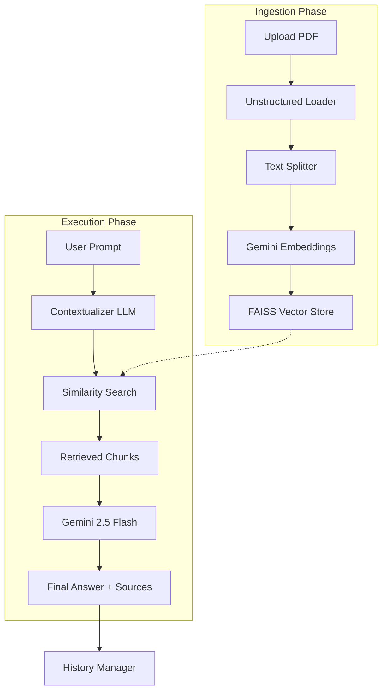

# 🧠 AI Knowledge Hub PRO - Project Documentation

## 📋 Project Overview
The **AI Knowledge Hub PRO** is an advanced Retrieval-Augmented Generation (RAG) system designed to provide deep intelligence and insights from large documents. It is specifically optimized for complex PDFs, supporting high-fidelity text extraction, table recognition, and visual context analysis using state-of-the-art AI models.

### 🌟 Key Capabilities
- **Massive File Support**: Handles documents up to 500MB.
- **High-Res Ingestion**: Uses `Unstructured` with OCR (Tesseract) to extract data from tables, images, and complex layouts.
- **Conversational Memory**: Maintains context across multiple turns and allows saving/loading of sessions.
- **Source Grounding**: Automatically provides citations (Source Pins) for every answer generated.
- **Multimodal LLM**: Powered by **Google Gemini 2.5 Flash** for fast and accurate reasoning.

---

## 🏗️ Architecture & Flow

### 🌊 Data Ingestion Flow (The "Index" Path)
1. **Upload**: User uploads PDFs through the Streamlit sidebar.
2. **Extraction**: `loader.py` uses `UnstructuredPDFLoader` with `hi_res` strategy to extract text and identify tables.
3. **Chunking**: `splitter.py` breaks the extracted text into manageable overlaps using `RecursiveCharacterTextSplitter`.
4. **Embedding**: `vector_store.py` converts text chunks into high-dimensional vectors using `GoogleGenerativeAIEmbeddings`.
5. **Persistence**: The vectors are stored in a local **FAISS** index (`app_db`) for lightning-fast retrieval.

### 💬 Query & Generation Flow (The "Chat" Path)
1. **Input**: User enters a question in the chat interface.
2. **Contextualization**: `rag_chain.py` uses the LLM to reformulate the question if it refers to previous messages (e.g., "What about the second one?").
3. **Retrieval**: The reformulated question is used to search the FAISS vector database for the top-N most relevant document chunks.
4. **Augmentation**: The original question, the retrieved context, and the chat history are formatted into a prompt.
5. **Generation**: **Gemini 2.5 Flash** generates a professional, concise response based *only* on the provided context.
6. **Delivery**: The answer and its source metadata (filename, page) are displayed to the user.
7. **History**: The interaction is saved to a JSON file in the `chats/` directory.

### 📊 Flow Diagram (Mermaid)

---

## 📁 Module Directory & Responsibilities

| Module | File Path | Responsibility |
| :--- | :--- | :--- |
| **Frontend** | `app.py` | Main Streamlit UI, state management, and orchestration of logic. |
| **Loader** | `core/loader.py` | Handles document parsing using `Unstructured` and `Tesseract`. |
| **Splitter** | `core/splitter.py` | Logic for chunking long documents into smaller segments. |
| **Vector DB** | `core/vector_store.py` | Manages FAISS database and Gemini embedding generation. |
| **RAG Chain** | `core/rag_chain.py` | The "brain" of the app; manages LLM prompts, chains, and retrieval logic. |
| **History** | `core/history.py` | Handles local JSON persistence for chat sessions. |

---

## 🛠️ Technical Specifications

- **LLM**: Google Gemini 2.5 Flash
- **Embeddings**: `models/gemini-embedding-001`
- **Vector Store**: FAISS (Facebook AI Similarity Search)
- **OCR Engine**: Tesseract OCR
- **PDF Processing**: Poppler (via Unstructured)
- **UI Framework**: Streamlit
- **Orchestration**: LangChain (LCEL)

---

## 🚀 Future Roadmap
- [ ] **Hybrid Search**: Combining keyword search (BM25) with vector search for better accuracy.
- [ ] **Reranking**: Using a Cross-Encoder to re-order retrieved chunks.
- [ ] **Multi-modal Querying**: Allowing users to upload images and ask questions about them directly.
- [ ] **Export Options**: Exporting chat history to PDF or Markdown.
