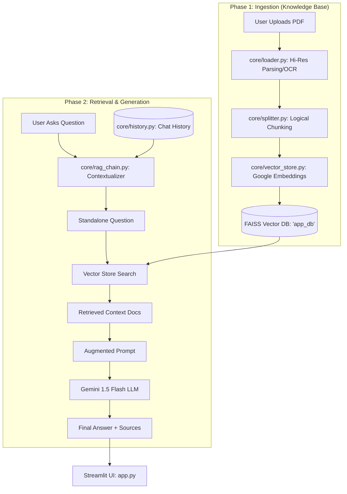

# 🧠 AI Knowledge Hub PRO

An advanced RAG (Retrieval-Augmented Generation) system built with **Streamlit**, **LangChain**, and **Google Gemini**. This system is designed for professional document intelligence, supporting high-resolution PDF parsing, table extraction, and image OCR.

---

## 📊 Data Flow Diagram (DFD)

This diagram explains how data moves from your local documents to the AI's response.



---

## 📂 Project Structure & Module Rationale

### `app.py` (The Command Center)
- **What**: The main entry point and User Interface.
- **Why**: Built with Streamlit for a premium, responsive, and interactive experience. It handles session states, file uploads, and real-time chat rendering.

### `core/loader.py` (The Eye)
- **What**: Handles document extraction using the `Unstructured` ecosystem.
- **Why**: Configured with `hi_res` strategy to ensure **OCR** (Optical Character Recognition) is applied to images and **Table Structure** is preserved. This is specifically designed to solve "Fig 1" or "Table 2" rendering issues by reconstructing the visual data into text for the AI.

### `core/splitter.py` (The Optimizer)
- **What**: Breaks large documents into manageable fragments (chunks).
- **Why**: LLMs have limited "context windows." By splitting text with smart overlap, we ensure the AI gets the most relevant information without losing surrounding context.

### `core/vector_store.py` (The Memory)
- **What**: Manages a local **FAISS** (Facebook AI Similarity Search) database and **Google Embeddings**.
- **Why**: Converts text into mathematical vectors. Instead of searching by keywords, the AI searches by *meaning* (semantic search), allowing it to find answers even if the wording is different.

### `core/rag_chain.py` (The Brain)
- **What**: Orchestrates the interaction between the user, the database, and the LLM.
- **Why**: Implements "Conversation Memory." It reformulates follow-up questions (e.g., "Tell me more about *it*") into standalone questions so the retrieval stays accurate throughout a long chat.

### `core/auth.py` & `history.py` (Personalization)
- **What**: User registration and per-user chat history storage.
- **Why**: Ensures multi-user capability and persists conversations. Includes an auto-cleanup feature for chats older than 7 days to keep the system lean.

---

## 🛠️ Technical Setup

### 1. Prerequisites
- **Tesseract OCR**: Required for image/PDF text extraction.
- **Poppler**: Required for PDF rendering/conversion.

### 2. Installation
```bash
pip install -r requirements.txt
```

### 3. Configuration
Create a `.env` file with your Google API Key:
```env
GOOGLE_API_KEY=your_key_here
```

### 4. Running the App
- **Web Interface (Recommended)**:
  ```bash
  streamlit run app.py
  ```
- **CLI Interface (Fast Debugging)**:
  ```bash
  python main.py
  ```

---

## 🌟 Premium Features
- **Semantic Answer Grounding**: Provides sources for every claim.
- **Table & Image Support**: Advanced ingestion captures complex document layouts.
- **Multi-User Security**: Encrypted password hashing and separate chat silos.
- **Self-Healing Chain**: Retry logic for API stability during high traffic.
