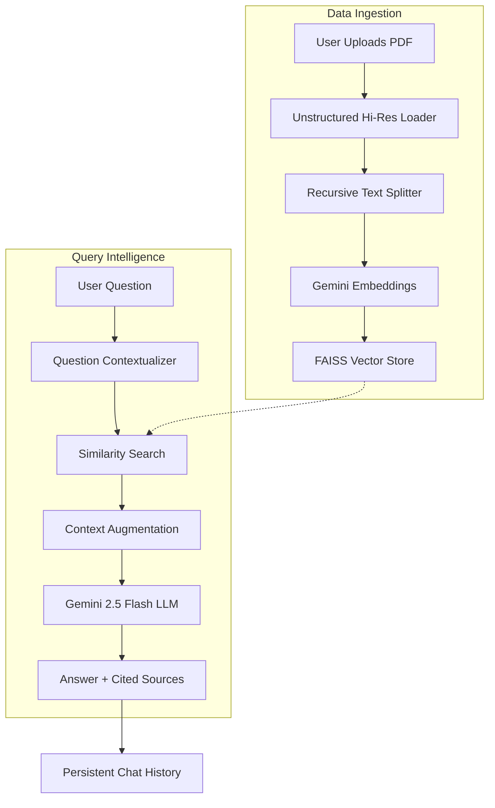

# 🧠 AI Knowledge Hub PRO

A high-performance AI Assistant designed for deep document analysis, specialized in processing large PDFs (up to 500MB) with support for **tables, images, and complex layouts**.


## 🚀 Key Features

- **High-Fidelity Ingestion**: Uses `Unstructured` + `Tesseract OCR` for extracting text from tables and complex images within PDFs.
- **200MB+ Support**: Optimized for large documents with a 500MB upload capacity.
- **Multimodal Intelligence**: Powered by **Gemini 2.5 Flash** for understanding both text and visual context.
- **Smart Conversation History**: Remembers context across sessions with a local persistent storage system.
- **Premium UI**: A sleek, responsive dashboard with custom CSS, source citations, and indexed document tracking.
- **Source Grounding**: Every answer is backed by specific "Source Pins" (📍) linking back to the original document.

---

## 🏗️ Architecture & Flow

### System Flow Diagram


### Module Breakdown
| Module | File | Description |
| :--- | :--- | :--- |
| **UI Engine** | `app.py` | Streamlit-based interface with custom premium CSS and session management. |
| **Knowledge Loader** | `core/loader.py` | Advanced PDF parsing using OCR and table structure inference. |
| **Logic Layer** | `core/rag_chain.py` | Manages the RAG pipeline, question reformulation, and LLM orchestration. |
| **Vector Engine**| `core/vector_store.py` | Handles local FAISS indexing and vector similarity search. |
| **Memory Manager**| `core/history.py` | Local JSON-based persistence for chat sessions and history tracking. |

---

## 🛠️ Tech Stack

- **Core**: Python 3.14, LangChain (LCEL)
- **LLM**: Google Gemini 2.5 Flash
- **Vector Store**: FAISS (Facebook AI Similarity Search)
- **OCR/Layout**: Unstructured, Tesseract OCR, Poppler
- **Frontend**: Streamlit (with Custom CSS Overlays)

## 📥 Installation

### 1. Prerequisites
You must have **Tesseract OCR** and **Poppler** installed and added to your System PATH.
- [Tesseract Installer](https://github.com/UB-Mannheim/tesseract/wiki)
- [Poppler Binaries](https://github.com/oschwartz10612/poppler-windows/releases)

### 2. Setup
```bash
# Clone the repository
git clone https://github.com/KalpShah1384/rag_assistant.git
cd rag_assistant

# Create virtual environment
python -m venv venv
.\venv\Scripts\activate

# Install dependencies
pip install -r requirements.txt
```

### 3. Environment Variables
Create a `.env` file in the root directory and add your API Key:
```env
GOOGLE_API_KEY=your_gemini_api_key_here
```

## 🚀 Usage

```bash
streamlit run app.py
```

1. **Upload**: Drop your PDF files into the sidebar (up to 500MB).
2. **Process**: Click "Process & Index" to build the knowledge base.
3. **Chat**: Ask complex questions about the text, tables, or charts.

## 🚢 Deployment (Hugging Face Spaces)

This project is optimized for Hugging Face Spaces. 
1. Create a new **Streamlit Space**.
2. Upload all files (including `packages.txt`).
3. Add your `GOOGLE_API_KEY` to the Space's **Secrets**.
4. Hugging Face will automatically install Tesseract and Poppler via `packages.txt`.

## 🛡️ Security
The project uses `.gitignore` to ensure your `.env` and local databases are NEVER uploaded to public repositories.

---
Advanced document intelligence for the modern era.
